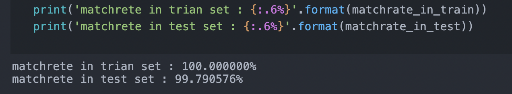
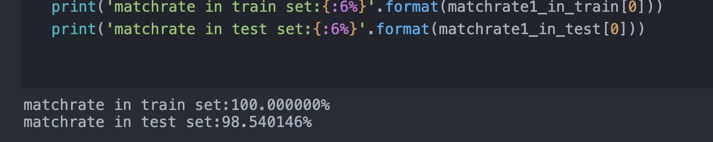

## 支持向量机作业

**无81 王东乔 2018011044**

代码运行环境为 APPLE MacBook air M1，python3.9.2，miniforge for M1 MacBook

```python
from sklearn import svm
from sklearn import preprocessing 
import numpy as np
import scipy.io as sio
import cvxpy as cp
```
### Assignment 1:任选一类使用SVM实现二分类

首先利用sklearn中的preprocessing对数据做了预处理（均值方差）

```python
scalar = preprocessing.StandardScaler()
x_train = scalar.fit_transform(x_train)
x_test = scalar.fit_transform(x_test)
```
选取label1 与其余九种二分类，使用线性核，参数默认。
得到的匹配率为：

训练集上100%的正确率，验证集上99.79%的正确率，结果良好且没有过拟合。

### Assignment 2:使用cvxpy实现二分类SVM

为方便，选择标签为1，2实现二分类
优化问题为：$min\frac{1}{2}||w||^2$，约束条件为$y_i(w^Tx_i+b)>=1$，通过参考凸优化工具包$cvxpy$，对给定的代码补全如下：
```python
obj = cp.Minimize(0.5 * cp.norm(w,2)** 2)
####
I = np.ones((60, 1),int)
#%%
### 此处填写优化问题的约束条件，如果有多个，以逗号隔开
constraint = [cp.multiply(y_train_n, x_train_1 @ w + b) >= I]

```
凸优化显示：optimal
正确率：

训练集上100%的正确率，验证集上98.54%的正确率，结果良好且没有过拟合。

### Assignment 3:SVM不同核，参数的比较
|  核   | 正确率 |
|  ----  | ----  |
| linear | 99.79% |
| rbf | 98.84 |
| poly | 96.43% |
本数据集线性核较之其他核更为准确。
|  线性核 C  | 正确率 |
|  ----  | ----  |
| 1000000| 99.79% |
| 1000| 99.79% |
| 1 | 99.79% |
| 0.0001 | 98.53% |
| 0.0000001 | 92.77%|
C值很小时正确率下降，这是因为此时超平面间距尽量大，所以会牺牲一些样本。
|  多项式核 degree | 正确率 |
|  ----  | ----  |
| 4| 95.08% |
| 5| 94.76% |
| 6| 94.24% |
阶数增加正确率下降，这是因为本数据集线性核正确率很高，其正确率大于默认的参数的多项式核（degree=3），所以增加阶数，超平面要有更多的弯曲，不可避免的牺牲一些样本。
|  高斯核 gamma | 正确率 |
|  ----  | ----  |
| 0.1| 92.77% |
| 0.001| 93.08% |
| 0.00000001| 92.77% |
gamma代表的是模型选座支持向量辐射范围的倒数，影响着高斯曲线的宽窄，其很小时，一个支持向量也会影响到整个模型，此时其他参数的选择很受限制，反之，其很大时，高斯曲线很窄，此时支持向量辐射范围只在自己附近，此时其他参数的选取不会很大的影响模型。